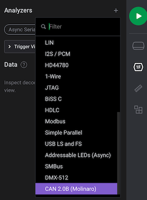
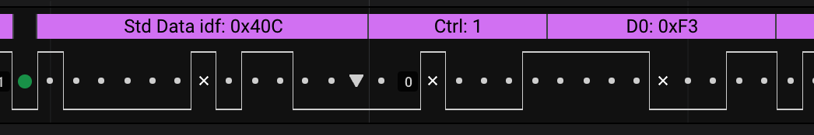
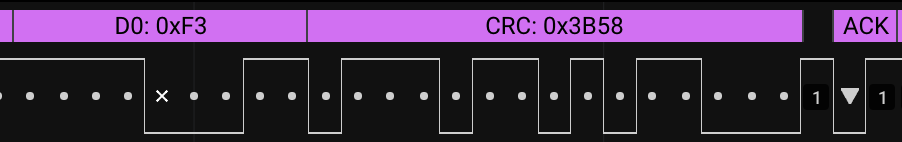
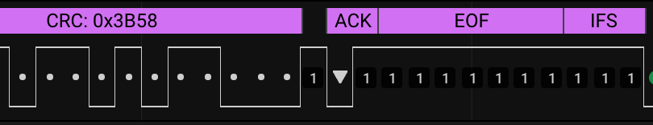
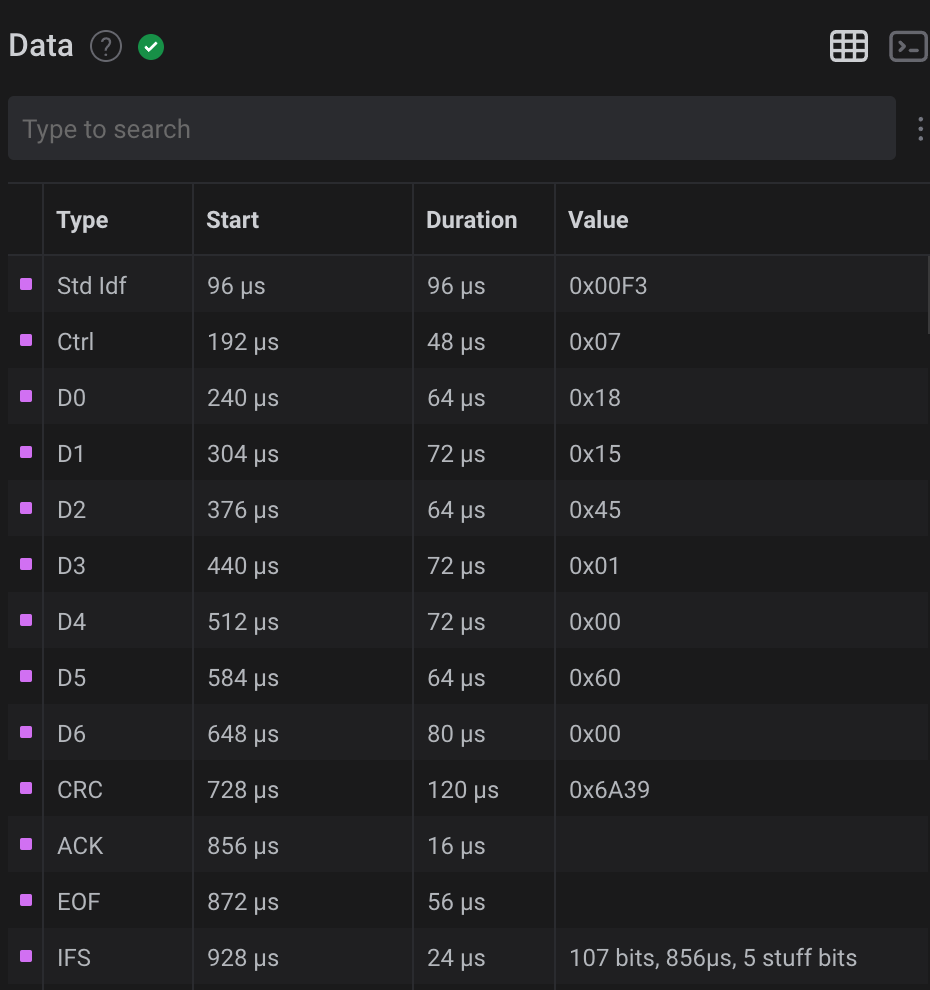

# CAN 2.0B (Molinaro): Controller Area Network (CAN) Analyzer for Saleae Logic 2 Analyzer

This is a plugin for Saleae Logic 2 Analyzers, built with Saleae Analyzer SDK. From July 22, 2022, it uses `FrameV2` so it can be used only with Saleae Logic 2.3.43 or newer.

## Building the plugin

For building the plugin, see [https://github.com/saleae/SampleAnalyzer](https://github.com/saleae/SampleAnalyzer)

## Generating Analyzer Simulation Data

(From [https://github.com/saleae/SampleAnalyzer](https://github.com/saleae/SampleAnalyzer))

*The Logic 2 software will need to be opened from the terminal using a specific command to enable simluation mode. Otherwise, by default, when an analyzer is added to digital channels while in Demo mode (i.e. no Logic is connected to the PC), the simulation data on those digital channels will contain seemingly random transitions and will not contain analyzer-specific data.*

*For instructions on enabling simulation mode on the Logic 2 software, please follow the instructions here:*
[https://support.saleae.com/user-guide/using-logic/demo-mode#generating-analyzer-simulation-data](https://support.saleae.com/user-guide/using-logic/demo-mode#generating-analyzer-simulation-data)

### How to permanently enable simulation on Mac OS X

Here is a trick for permanently enabling simulation on Mac OS X. Just copy the `name.pcmolinaro.saleaeEnableSimulation.plist` file (located in `enable-simulation-on-osx` directory) in your `~/Library/LaunchAgents` directory. Then log out then log in (or restart), it is done, simulation is permanently enabled.

For permanently  disabling this feature, delete `~/Library/LaunchAgents/name.pcmolinaro.saleaeEnableSimulation.plist` and log out then log in (or restart).

## Selecting Analyzer

The analyzer Name is `CAN 2.0B (Molinaro)`.

## Plugin settings

### CAN Bit Rate

Usual CAN bit rates settings are `1000000` (1 Mbit/s), `500000` (500 kbit/s), `250000` (250 kbit/s), `125000` (125 kbit/s), `62500` (62.5 kbit/s). But you can use any custom setting (maximum is 1 Mbit/s).

### Dominant Logic Level

Usually, CAN Dominant level is `LOW` logic level. This setting enables selecting `HIGH` as dominant level. 

### Simulator Random Seed

*This setting is only used be the simulator. The simulator is enabled when no device is connected the analyzer.*

The simulator generates random frames. This setting defines the initial value of this parameter, making frame generation reproducible. 

### Simulator Generated Frames Format

*This setting is only used be the simulator. The simulator is enabled when no device is connected the analyzer.*

You can set the format (standard / extended) and the the type (data / remote) that the simulator generates:

* `All Types`: the simulator randomly generates standard / extended, data / remote frames;
* `Only Standard Data Frames`: the simulator randomly generates standard data frames;
* `Only Extended Data Frames`: the simulator randomly generates extended data frames;
* `Only Standard Remote Frames`: the simulator randomly generates standard remote frames;
* `Only Extended Remote Frames`: the simulator randomly generates extended remote frames.

### Simulator ACK SLOT generated level

*This setting is only used be the simulator. The simulator is enabled when no device is connected the analyzer.*

The `ACK SLOT` field of a CAN 2.0B frame is sent recessive, and set dominant by any receiver that gets the frame without any error.

Three settings are available:

* `Dominant`: the simulator generates frames with the ACK SLOT bit dominant;
* `Recessive`: the simulator generates frames with the ACK SLOT bit recessive;
* `Random`: the simulator generates frames with the ACK SLOT bit randomly dominant or recessive.

### Simulator Generated Frames Validity

*This setting is only used be the simulator. The simulator is enabled when no device is connected the analyzer.*

The simulator can generate valid frames, or frames with errors.

Two settings are available:

* `Generate Valid Frames`: the simulator generates valid frames;
* `Randomly toggle one bit`: in every generated frame, one random bit is inverted.

##Capture Display

This is the capture of a Standard data frame, identifier `0x40C`, one data byte (`0xF3`), with `ACK SLOT` dominant.

By default, the center of a bit is indicated with a dot.

The green dot is the `SOF` (*Start Of Frame*) field.

A white `X` is a Stuff Bit.

A fixed form bit is denoted by a `0` (for a dominant bit) or a `1` (recessive bit). *Note the level inversion does not change the annotation.* 

The `RTR` and the `SRR` bits are denoted by an `up arrow` (if recessive), or a `down arrow` (if dominant).

A recessive `ACK SLOT` bit is marked with a red `X`, an active one with a down arrow.

Errors are in red color: a red `X` is a Stuff Error, and following bits are tagged with red dots until the bus returns free (11 consecutive recessive bits).

## Bubble Text

The bubble text is the text over the capture.

All CAN frames fields are reported, but:

* the `SOF` field that is denoted by a green dot.
* the `CRC DEL` field, a fixed form recessive bit after the `CRC` field.

If a CRC error is detected, the text is `CRC: xxx (error)`.
 
## Terminal

For each frame, the terminal contains:

* the identifier;
* the data bytes;
* if there is a CRC error, the CRC field;
* the frame bit length, its duration, and the number of stuff bits.

 
## Data Table

Every frame field is reported in data table. At the end of the frame, for `IFS` field, the frame length, the number of stuff bits are printed.

